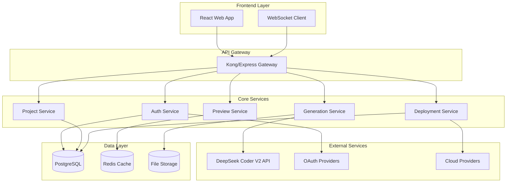

# Mockwave SaaS Platform - Design Document

## Overview

Mockwave is a cloud-native SaaS platform built as a microservices architecture that leverages Large Language Models to automatically generate complete backend projects from user specifications. The platform consists of a React-based frontend, Node.js/Express backend services, and integrates with DeepSeek Coder V2 API for intelligent code generation.

## Architecture

### High-Level Architecture



### Technology Stack

**Frontend:**
- React 18 with TypeScript
- Tailwind CSS for styling
- React Query for state management
- Monaco Editor for code viewing
- WebSocket for real-time updates

**Backend:**
- Node.js with Express.js
- TypeScript for type safety
- JWT for authentication
- WebSocket (Socket.io) for real-time communication

**Database & Storage:**
- PostgreSQL for relational data
- Redis for caching and sessions
- AWS S3 for file storage

**External Integrations:**
- DeepSeek Coder V2 API for LLM services
- OAuth providers (Google, GitHub, Microsoft)
- Cloud deployment APIs (Vercel, Netlify, AWS)

## Components and Interfaces

### 1. Authentication Service

**Responsibilities:**
- OAuth integration and user management
- JWT token generation and validation
- Subscription tier management

**Key Interfaces:**
```typescript
interface AuthService {
  authenticateUser(provider: string, code: string): Promise<AuthResult>
  validateToken(token: string): Promise<User>
  refreshToken(refreshToken: string): Promise<TokenPair>
  updateSubscription(userId: string, tier: SubscriptionTier): Promise<void>
}

interface User {
  id: string
  email: string
  name: string
  provider: string
  subscriptionTier: SubscriptionTier
  createdAt: Date
  lastLoginAt: Date
}
```

### 2. Project Service

**Responsibilities:**
- Project CRUD operations
- Version management
- Sharing and collaboration

**Key Interfaces:**
```typescript
interface ProjectService {
  createProject(userId: string, spec: ProjectSpec): Promise<Project>
  getProject(projectId: string, userId: string): Promise<Project>
  updateProject(projectId: string, updates: Partial<Project>): Promise<Project>
  deleteProject(projectId: string, userId: string): Promise<void>
  shareProject(projectId: string, permissions: SharePermissions): Promise<string>
}

interface Project {
  id: string
  userId: string
  name: string
  description: string
  specification: ProjectSpec
  generatedCode: GeneratedCode
  status: ProjectStatus
  createdAt: Date
  updatedAt: Date
}
```

### 3. Generation Service

**Responsibilities:**
- LLM integration and prompt management
- Code generation orchestration
- Input format parsing and validation

**Key Interfaces:**
```typescript
interface GenerationService {
  generateBackend(spec: ProjectSpec): Promise<GeneratedCode>
  parseSpecification(input: SpecificationInput): Promise<ProjectSpec>
  validateSpecification(spec: ProjectSpec): Promise<ValidationResult>
}

interface ProjectSpec {
  format: 'natural' | 'yaml' | 'json' | 'wizard'
  content: string | object
  preferences: GenerationPreferences
}

interface GeneratedCode {
  framework: string
  language: string
  files: CodeFile[]
  dependencies: Dependency[]
  configuration: Configuration
}
```

### 4. Preview Service

**Responsibilities:**
- Mock server generation and management
- Interactive API documentation
- Real-time code preview

**Key Interfaces:**
```typescript
interface PreviewService {
  createPreview(projectId: string): Promise<PreviewInstance>
  getPreviewUrl(previewId: string): Promise<string>
  updatePreview(previewId: string, code: GeneratedCode): Promise<void>
  deletePreview(previewId: string): Promise<void>
}

interface PreviewInstance {
  id: string
  projectId: string
  url: string
  status: 'starting' | 'running' | 'stopped' | 'error'
  endpoints: APIEndpoint[]
  createdAt: Date
}
```

### 5. Deployment Service

**Responsibilities:**
- Cloud provider integration
- Deployment orchestration
- Status monitoring

**Key Interfaces:**
```typescript
interface DeploymentService {
  deploy(projectId: string, provider: CloudProvider, config: DeploymentConfig): Promise<Deployment>
  getDeploymentStatus(deploymentId: string): Promise<DeploymentStatus>
  updateDeployment(deploymentId: string, updates: DeploymentUpdate): Promise<void>
  deleteDeployment(deploymentId: string): Promise<void>
}

interface Deployment {
  id: string
  projectId: string
  provider: CloudProvider
  url: string
  status: DeploymentStatus
  configuration: DeploymentConfig
  createdAt: Date
}
```

## Data Models

### Database Schema

```sql
-- Users table
CREATE TABLE users (
  id UUID PRIMARY KEY DEFAULT gen_random_uuid(),
  email VARCHAR(255) UNIQUE NOT NULL,
  name VARCHAR(255) NOT NULL,
  provider VARCHAR(50) NOT NULL,
  provider_id VARCHAR(255) NOT NULL,
  subscription_tier VARCHAR(20) DEFAULT 'free',
  created_at TIMESTAMP DEFAULT NOW(),
  last_login_at TIMESTAMP DEFAULT NOW()
);

-- Projects table
CREATE TABLE projects (
  id UUID PRIMARY KEY DEFAULT gen_random_uuid(),
  user_id UUID REFERENCES users(id) ON DELETE CASCADE,
  name VARCHAR(255) NOT NULL,
  description TEXT,
  specification JSONB NOT NULL,
  generated_code JSONB,
  status VARCHAR(20) DEFAULT 'draft',
  created_at TIMESTAMP DEFAULT NOW(),
  updated_at TIMESTAMP DEFAULT NOW()
);

-- Deployments table
CREATE TABLE deployments (
  id UUID PRIMARY KEY DEFAULT gen_random_uuid(),
  project_id UUID REFERENCES projects(id) ON DELETE CASCADE,
  provider VARCHAR(50) NOT NULL,
  url VARCHAR(500),
  status VARCHAR(20) DEFAULT 'pending',
  configuration JSONB,
  created_at TIMESTAMP DEFAULT NOW(),
  updated_at TIMESTAMP DEFAULT NOW()
);

-- Project shares table
CREATE TABLE project_shares (
  id UUID PRIMARY KEY DEFAULT gen_random_uuid(),
  project_id UUID REFERENCES projects(id) ON DELETE CASCADE,
  share_token VARCHAR(255) UNIQUE NOT NULL,
  permissions JSONB NOT NULL,
  expires_at TIMESTAMP,
  created_at TIMESTAMP DEFAULT NOW()
);
```

## Error Handling

### Error Categories

1. **Validation Errors (400)**
   - Invalid specification format
   - Missing required fields
   - Malformed input data

2. **Authentication Errors (401/403)**
   - Invalid or expired tokens
   - Insufficient permissions
   - Subscription tier limitations

3. **Generation Errors (422)**
   - LLM API failures
   - Unsupported specification features
   - Code generation timeouts

4. **Infrastructure Errors (500/503)**
   - Database connection failures
   - External service unavailability
   - Deployment provider errors

### Error Response Format

```typescript
interface ErrorResponse {
  error: {
    code: string
    message: string
    details?: any
    timestamp: string
    requestId: string
  }
}
```

### Retry and Fallback Strategies

- **LLM API calls**: Exponential backoff with 3 retries
- **Database operations**: Connection pooling with failover
- **File uploads**: Chunked upload with resume capability
- **Deployments**: Queue-based processing with manual retry options

## Testing Strategy

### Unit Testing
- Service layer methods with mocked dependencies
- Utility functions and data transformations
- Input validation and parsing logic
- Target: 80% code coverage

### Integration Testing
- API endpoint testing with test database
- External service integration mocking
- Authentication flow testing
- Database migration testing

### End-to-End Testing
- Complete user workflows (signup → create → preview → deploy)
- Cross-browser compatibility testing
- Performance testing under load
- Security testing for authentication and authorization

### Testing Tools
- **Unit**: Jest with TypeScript support
- **Integration**: Supertest for API testing
- **E2E**: Playwright for browser automation
- **Load**: Artillery for performance testing

### Continuous Integration
- Automated testing on pull requests
- Code quality checks with ESLint and Prettier
- Security scanning with Snyk
- Deployment testing in staging environment